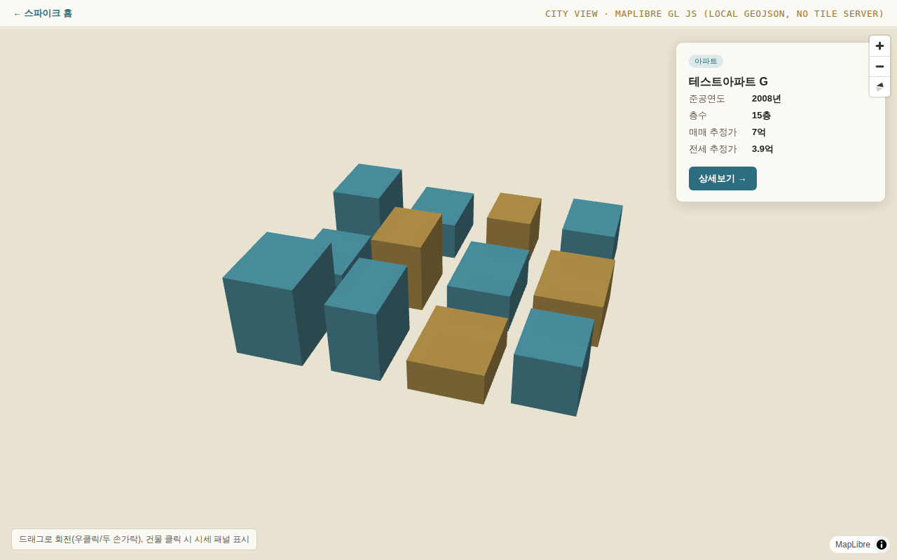
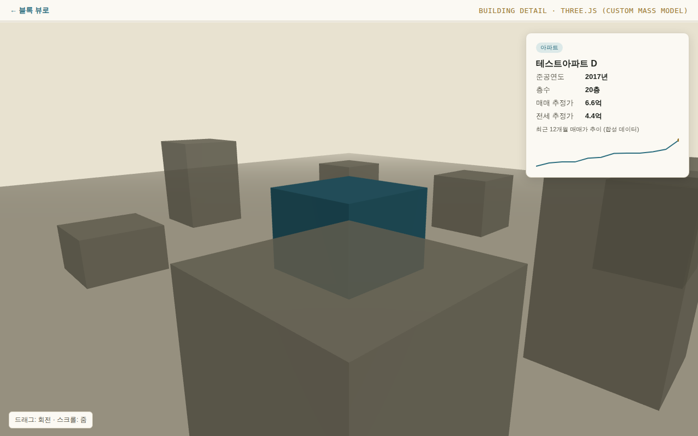

# 기술 스파이크 결과 — 3D 스택 (PRD 9번 항목)

- **작성일**: 2026-08-20
- **범위**: PRD `docs/PRD.md` 9번(3D 기술 스택 후보)에서 제안한 하이브리드 구조의 기술 검증
- **코드**: `spike/3d-viewer/`

## 1. 검증 방법 및 제약

이 스파이크는 CI/개발 샌드박스 환경에서 진행되어 **외부 지도 타일 서버·CDN에 접근할 수 없었습니다** (프록시 정책상 npm 레지스트리 등 일부 도메인만 허용). 그래서 다음 두 가지로 범위를 조정했습니다.

- **직접 검증**: MapLibre GL JS의 3D 압출(fill-extrusion) 렌더링, Three.js 커스텀 매스 모델 렌더링, 클릭 인터랙션, 화면 간 전환, 프로덕션 번들 크기 — 모두 로컬 합성 GeoJSON 데이터로 실제 브라우저(Chromium, Playwright)에서 렌더링까지 확인.
- **미검증 (다음 단계 필요)**: 실제 카카오/네이버/브이월드 API 연동, 국내 좌표계 변환, 실기기 모바일 성능. 아래 "남은 검증 항목" 참고.

## 2. 핵심 결정: Mapbox GL JS → MapLibre GL JS로 대체 제안

PRD 9번에서는 "Mapbox GL JS 또는 CesiumJS"를 후보로 뒀는데, 스파이크는 **MapLibre GL JS**(Mapbox GL JS v1 이후 오픈소스로 포크되어 API가 거의 동일하게 유지되는 라이브러리)로 진행했습니다.

- Mapbox GL JS는 v2부터 독점 라이선스로 전환되어 API 키·사용량 과금이 필요합니다.
- MapLibre GL JS는 API가 호환되고(마이그레이션 비용 낮음), 오픈소스라 벤더 종속·토큰 비용 이슈가 없습니다.
- 국내 지도 데이터(브이월드, 카카오, 네이버)는 어차피 자체 타일/API 계약이 필요하므로, 베이스 라이브러리를 Mapbox 대신 MapLibre로 바꿔도 "지도 데이터 소스 연동"이라는 작업량 자체는 달라지지 않습니다.

**제안**: PRD 9번의 "Mapbox GL JS" 후보를 **MapLibre GL JS**로 교체. CesiumJS는 이번 스파이크에서 실험하지 않았음 — Cesium ion 계정·토큰이 필요하고(마찬가지로 벤더 종속), 글로벌 지형/포토리얼리스틱 타일이 이 서비스에 필수 요건이 아니라고 판단해 우선순위를 낮췄습니다. 광역 지형이 실제로 필요해지면 재검토.

## 3. 검증 결과

### 3.1 블록/도시 뷰 (MapLibre GL JS)

외부 타일 서버 없이, 로컬 GeoJSON 건물 폴리곤 + `fill-extrusion` 레이어만으로 3D 압출 렌더링이 정상 동작함을 확인했습니다. 매물 유형별 색상 구분, 클릭 시 시세 정보 패널 표시, 패널의 "상세보기" 버튼으로 건물 상세 뷰(Three.js)로 전환까지 end-to-end로 확인.

### 3.2 건물 상세 뷰 (Three.js)

선택된 건물을 커스텀 박스 매스로 렌더링하고, 주변 컨텍스트 건물(합성 데이터의 나머지 필지)을 배치. OrbitControls로 회전/줌 가능하고, 가격 추이 스파크라인을 SVG로 오버레이. URL 쿼리(`?id=`)로 블록 뷰에서 선택한 건물 ID를 전달받아 동일 데이터를 재사용하는 방식이 문제없이 동작.

### 3.3 번들 크기 (프로덕션 빌드 기준)

| 청크 | 원본 | gzip |
|---|---|---|
| city-view (MapLibre 포함) | 803 KB | 218 KB |
| building-detail (Three.js 포함) | 491 KB | 124 KB |

**리스크**: PRD 7번 비기능 요구사항의 "3D 뷰 초기 로딩 3초 이내(모바일 4G 기준)" 목표 대비, MapLibre 청크(gzip 218KB)는 4G 환경에서 빠듯할 수 있습니다. 페이지별로 번들이 이미 분리되어 있다는 점(도시 뷰와 상세 뷰가 별도 청크)은 유리하지만, 추가로:
- 초기 진입 시 저해상도/2D 프리뷰를 먼저 보여주고 3D 씬을 지연 로드하는 방식 검토
- PRD 7번에 이미 명시된 "저사양 기기 폴백(2D 지도+사진)"을 실제 네트워크 속도 기준으로도 트리거하는 방안 검토

### 3.4 렌더링 환경

이 샌드박스에는 GPU가 없어 소프트웨어 렌더링(SwiftShader)으로 겨우 동작했습니다. 실제 사용자 브라우저는 대부분 GPU 가속을 사용하므로 이 환경의 성능 수치(FPS 등)는 참고하지 않았고, 렌더링 결과물(스크린샷)의 정합성만 확인했습니다. **실기기 성능 측정은 별도로 필요합니다.**

## 4. 결론 — 하이브리드 구조는 기술적으로 실행 가능

PRD 9번에서 제안한 "도시/블록 스케일은 지도 기반 3D, 개별 건물 상세는 커스텀 씬" 구조는 라이브러리 전환(클릭 → 페이지/뷰 전환) 관점에서 막힘없이 구현 가능함을 확인했습니다. 두 엔진을 같은 데이터 모델(건물 ID, 좌표, 높이, 가격)로 연결하는 것도 문제없었습니다.

## 5. 남은 검증 항목 (실 API 키 확보 후)

1. **브이월드 3D 건물 API** 실제 연동 — 데이터 포맷, 좌표계(카카오/네이버는 자체 좌표계를 쓰는 경우가 있어 WGS84 변환 필요할 수 있음), 커버리지·정밀도 확인
2. **카카오맵/네이버 지도** 기본 타일 연동 및 트래픽 과금 정책 확인
3. 실제 실거래가 데이터로 채운 건물 수백~수천 개 규모에서 MapLibre 렌더링 성능(이번 스파이크는 12개 건물만 사용)
4. 실기기(중저가 안드로이드 등)에서의 실제 FPS·로딩 시간 측정
5. 개별 건물의 "상세" 매스를 박스가 아닌 실제 외형에 가깝게 만들 방법 — 자체 모델링 vs 브이월드 데이터로 압출

## 6. PRD 반영 사항

- PRD 9번 "3D 기술 스택 후보" 표의 Mapbox GL JS 항목을 MapLibre GL JS로 교체 권장 (본 문서가 근거)
- Next Steps에 "실 API 키(브이월드/카카오/네이버) 확보 후 5번 항목 재검증" 추가
